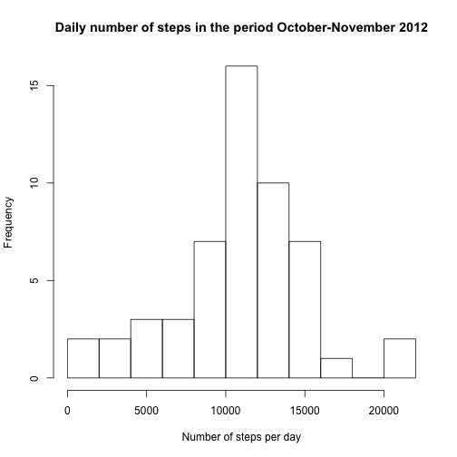
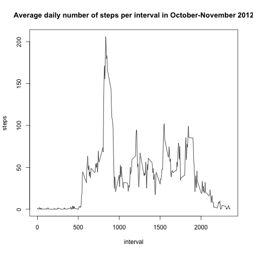
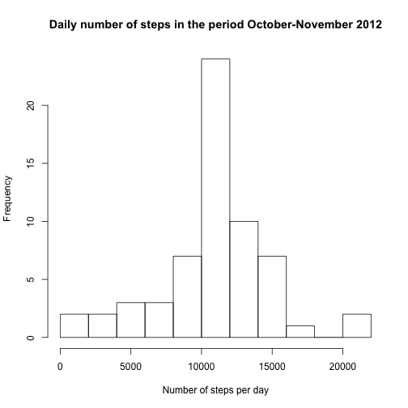
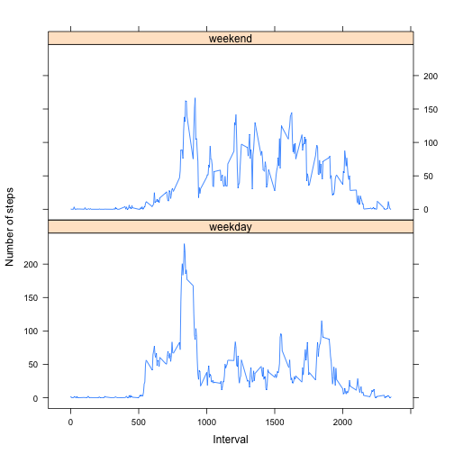

# Reproducible Research: Peer Assessment 1

## Loading and preprocessing the data

### Loading the data
Load the data under the assumption that the file is unzipped.


```r
setwd("/Users/filipderyckere/Documents/coursera/Data science/Code/Reproducible research/Assignment1")
data <- read.csv("activity.csv", header=TRUE)
```

Let's have a look at the first rows:

```r
head(data)
```

```
##   steps       date interval
## 1    NA 2012-10-01        0
## 2    NA 2012-10-01        5
## 3    NA 2012-10-01       10
## 4    NA 2012-10-01       15
## 5    NA 2012-10-01       20
## 6    NA 2012-10-01       25
```

The structure of the dataset is: 

```r
str(data)
```

```
## 'data.frame':	17568 obs. of  3 variables:
##  $ steps   : int  NA NA NA NA NA NA NA NA NA NA ...
##  $ date    : Factor w/ 61 levels "2012-10-01","2012-10-02",..: 1 1 1 1 1 1 1 1 1 1 ...
##  $ interval: int  0 5 10 15 20 25 30 35 40 45 ...
```
The dataset has **17568 entries**. This is 61 days x 24 hours/day x 60 minutes/hour divided by 0.2 entries/minute.     

### Cleaning the data
We transform the dates from character to date format for easier processing in the graphs.   

```r
data$date <- as.Date(as.character(data$date))
str(data)
```

```
## 'data.frame':	17568 obs. of  3 variables:
##  $ steps   : int  NA NA NA NA NA NA NA NA NA NA ...
##  $ date    : Date, format: "2012-10-01" "2012-10-01" ...
##  $ interval: int  0 5 10 15 20 25 30 35 40 45 ...
```

Verify how the NAs in steps are distributed.

```r
missingdata <- tapply(data$steps, data$date, function(x) {sum(is.na(x))})
table(missingdata)
```

```
## missingdata
##   0 288 
##  53   8
```
Measurements are missing for 8 complete days. Since only complete days are missing (8 days with 288 entries), the NAs will not have an impact on the totals and means per day. Therefore, no cleaning or corrections are made on these data.

## What is mean total number of steps taken per day?
First aggregate the number of steps per day, then plot the histogram. Measurements with NA are disregarded.

```r
stepsperday <- aggregate(steps~date, data, sum, na.rm=TRUE)
h <- hist(stepsperday$steps,
     breaks=10,
     xlab="Number of steps per day", 
     main="Daily number of steps in the period October-November 2012")
```

 

```r
h$counts
```

```
##  [1]  2  2  3  3  7 16 10  7  1  0  2
```

To calculate the mean and median number of steps per day, we use the summary() function.

```r
summary <- summary(stepsperday$steps)
summary
```

```
##    Min. 1st Qu.  Median    Mean 3rd Qu.    Max. 
##      41    8840   10800   10800   13300   21200
```


The **median** number of steps per day is 1.08 &times; 10<sup>4</sup>. The **mean** value is 1.08 &times; 10<sup>4</sup>.

## What is the average daily activity pattern?
We calculate and plot the average number of steps per interval across dates.

```r
stepsperinterval <- aggregate(steps~interval, data, match.fun(mean), na.rm=TRUE)
# For some reason or another, the function calculating the mean value gives an error when match.fun is omitted in knitr.
plot(stepsperinterval, type="l",
     main="Average daily number of steps per interval in October-November 2012")
```

 


We now calculete the interval with the most average steps.

```r
max <- stepsperinterval[order(stepsperinterval$steps, decreasing=TRUE)[1], ]
```
The 5-minute interval with the maximum average number of steps is 835; this interval has on average 206.1698 steps per day. 

## Imputing missing values

Unlike mentioned in the exercise, only complete days are missing as we have seen above. 
We assume that the person's habits are equal for the days. And we are interested in the steps per intervald. The strategy for filling in the blanks is for each interval of a particular day, to take the mean of similar days for the same interval. E.g. a missing value for interval 10 on a Monday, will be filled by the mean of all steps during the interval 10 of all other Mondays.


```r
dataCleaned <- data

# Calculate the table of means per interval
means <- tapply(data$steps, data$interval, mean, na.rm=TRUE)

# Replace the NA values
dataCleaned[is.na(dataCleaned$steps), "steps"] <- means[as.character(dataCleaned[is.na(dataCleaned$steps), "interval"])]
```


Now, we compare the differences with the initial dataset's histogram and mean/median.

```r
stepsperday <- aggregate(steps~date, dataCleaned, sum, na.rm=TRUE)
h <- hist(stepsperday$steps, 
     breaks=10,
     xlab="Number of steps per day", 
     main="Daily number of steps in the period October-November 2012")
```

 

```r
h$counts
```

```
##  [1]  2  2  3  3  7 24 10  7  1  0  2
```

```r
summary(stepsperday)
```

```
##       date                steps      
##  Min.   :2012-10-01   Min.   :   41  
##  1st Qu.:2012-10-16   1st Qu.: 9819  
##  Median :2012-10-31   Median :10766  
##  Mean   :2012-10-31   Mean   :10766  
##  3rd Qu.:2012-11-15   3rd Qu.:12811  
##  Max.   :2012-11-30   Max.   :21194
```
The mean and median are slightly lower than the initial dataset. The hypothesis is that the number of steps are not equally spread over all days.
Logically, we see from the histogram that the number of days with the mean number of steps has increased with the 8 missing days. The frequency passed from 16 to 24.

## Are there differences in activity patterns between weekdays and weekends?
First, calculate the average number of steps per day in the week or the weekend.

```r
dataCleaned <- transform(dataCleaned, day = factor(weekdays(date) %in% c("Saturday", "Sunday"), labels=c("weekday", "weekend")))
stepsperinterval <- aggregate(steps~interval+day, dataCleaned, match.fun(mean), na.rm=TRUE)
```

Use the lattice package to plot a line chart as requested.

```r
library(lattice)
xyplot(steps~interval | day, stepsperinterval, layout=c(1,2), type="l", xlab="Interval", ylab="Number of steps")
```

 

The pattern is clearly different during weekdays and weekends. During the week, the person gets up more early than in the weekend. He probably goes to work or exercises around 8:30 during the week. In the weekend, his steps are more evenly levelled than during the week. He probably sits during work.

